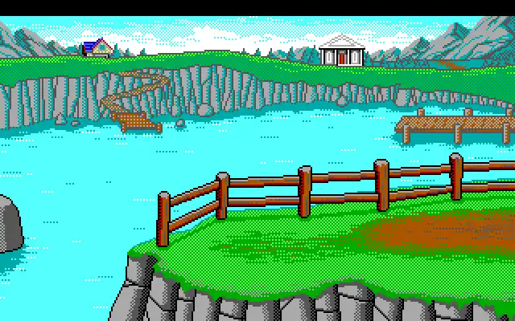
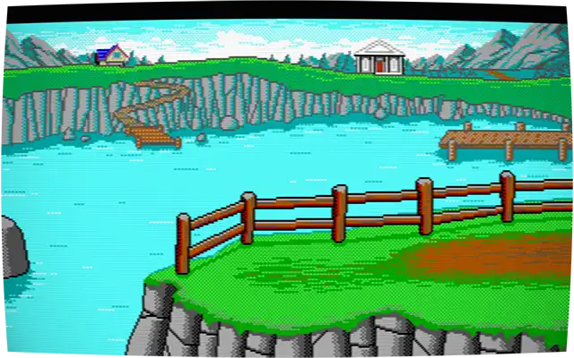

# `@4bitlabs/crt-lite`

A tiny, simple CRT-like `webgl2`-based canvas renderer for ImageData

| Before                             | After                             |
| ---------------------------------- | --------------------------------- |
|  |  |

## Example

```ts
import { createCrtRenderer } from '@4bitlabs/crt-lite';

// Setup the canvas element to draw to.
const target = document.getElementById('target');
const { update } = createCrtRenderer(canvasEl);

// Get some image data
const source = document.getElementById('source');
const ctx = source.getContext('2d');
/* draw whatever you want */
const imgData = ctx.getImageData(0, 0, ctx.width, ctx.height);

//🪄🎩🐰
update(imgData);
```

## Render Parameters

There are several tunable options when calling the update function that can be used to adjust the style of monitor.

| Setting     | Type      | Description                                            |
| ----------- | --------- | ------------------------------------------------------ |
| `Fx`        | `number`  | Horizontal monitor curve/barrel distortion.            |
| `Fy`        | `number`  | Vertical monitor curve/barrel distortion.              |
| `S`         | `number`  | Monitor zoom.                                          |
| `hBlur`     | `number`  | Fast <small>GPU</small> horizontal box-blur in pixels. |
| `grain`     | `number`  | Monitor grain. `0.0` = none/off, `1.0` = max.          |
| `vignette`  | `number`  | CRT Vignetting. `0.0` = none/off, `1.0` = max.         |
| `scanLines` | `boolean` | CGA/EGA monitor scan-line simulation.                  |

```ts
import { createCrtRenderer, type CrtUpdateOptions } from '@4bitlabs/crt-lite';

const { update } = createCrtRenderer(canvasEl);

const crtOptions: CrtUpdateOptions = {
  Fx: -0.025,
  Fy: -0.035,
  S: 0.995,
  hBlur: 2.0,
  grain: 0.125,
  vignette: 1.0,
  scanLines: true,
};

update(imgData, crtOptions);
```

You can also set up a set of render defaults as the _base_ for every render.

```ts
import { createCrtRenderer, type CrtUpdateOptions } from '@4bitlabs/crt-lite';

const renderDefaults: CrtUpdateOptions = {
  Fx: -0.025,
  Fy: -0.035,
  S: 0.995,
  hBlur: 2.0,
  grain: 0.125,
  vignette: 1.0,
  scanLines: true,
};

const { update } = createCrtRenderer(canvasEl, { renderDefaults });

// Render using the defaults…
update(imgData);

// Override and disable the grain for just this render.
update(imgData, { grain: 0.0 });
```
